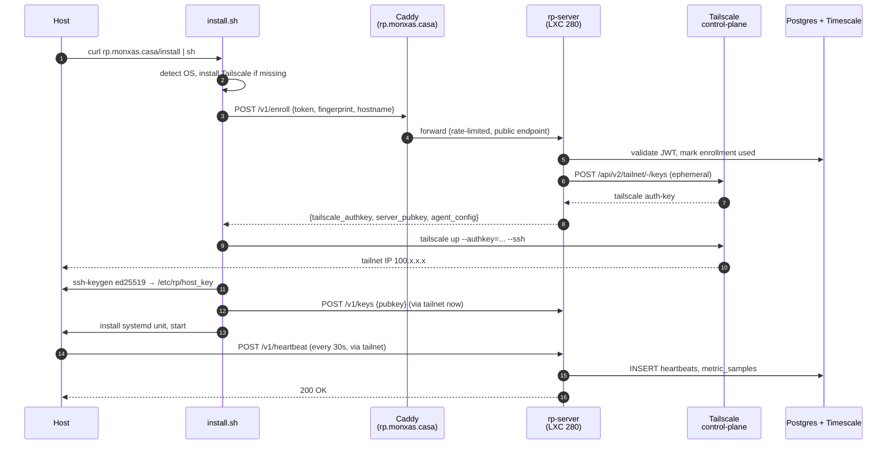

# Architecture overview

Remote-Pulse is a split-repo system:

- **`monxas/remote-pulse`** (this public repo) — the agent, CLI, install
  scripts, packaging, and these docs.
- **`monxas/homelab-infra`** (private) — the server, Ansible role, Grafana
  dashboards, group config.

The agent reads `RP_SERVER_URL` and `RP_ENROLLMENT_TOKEN` from env or CLI
flags. It has zero knowledge of the homelab inventory; the server holds all
secrets.

## Boot-to-heartbeat sequence



After step 13 the host is "alive" in the fleet. Subsequent traffic stays on
the tailnet; the public `rp.monxas.casa` endpoint is only used for
`/v1/enroll` and `/v1/agent/reauth`.

## Component view

```mermaid
flowchart TB
    subgraph PublicNet["Public internet"]
      User[Operator browser]
      Fam[Family laptop<br/>(bootstrap)]
    end

    subgraph CFAccess["Caddy HA (LXC 270/271)"]
      CADDY[rp.monxas.casa<br/>dash.rp.monxas.casa]
    end

    subgraph Tailnet["Tailnet (WireGuard)"]
      subgraph LXC280["LXC 280 — rp-server"]
        TSD[tailscaled<br/>daemon]
        TSV[tailscale serve<br/>identity inject]
        FAPI[FastAPI<br/>app]
        PG[(Postgres 16<br/>+ TimescaleDB)]
      end
      A1[Agent rp<br/>linux]
      A2[Agent rp<br/>macos]
      A3[Agent rp<br/>windows]
    end

    subgraph HomelabReuse["Reused stack"]
      Pocket[PocketID OIDC]
      Loki[Loki + Promtail]
      Prom[Prometheus]
      Graf[Grafana]
      N8N[n8n + Telegram bot]
    end

    User --> CADDY
    Fam --> CADDY
    CADDY -- bootstrap only --> FAPI
    CADDY -- forward_auth --> Pocket
    A1 <--> TSD
    A2 <--> TSD
    A3 <--> TSD
    TSD --> TSV --> FAPI --> PG
    FAPI --> Loki
    FAPI --> Prom
    Prom --> Graf
    PG -.audit log dual sink.-> Loki
    FAPI -- approval_required --> N8N
```

## Key design choices

| Decision | Why | ADR section |
|----------|-----|-------------|
| Split public/private repos | Curl-pipe-sh must be auditable, server must not leak inventory. | §1 Topology |
| Tailscale as data plane | Free, NAT-traversal solved, identity headers free. | §2 Transport |
| Python 3.12 + uv + PyInstaller | Cohesive with homelab stack; `pipx` for power-users, binaries for everyone else. | §3 Runtime |
| FastAPI + Postgres + TimescaleDB | Pythonic, hypertables make sparkline queries cheap. | §4, §9 |
| 3-layer auth | Tailscale identity (agents) + JWT (bootstrap) + PocketID (humans). | §5 |
| Declarative SSH keys | Group YAML + audit log + soft revocation. | §6 |
| Tailscale SSH + RustDesk Direct IP + Sunshine | Three protocols cover shell, GUI, gaming-grade. | §7 |
| TUI primary, web secondary, Grafana tertiary | Build order matches operator workflow. | §8 |
| Multi-channel WebSocket | Control / metrics / inventory / logs each own their backpressure. | §12 |
| Agent-side local-approval | Defense-in-depth: server compromise ≠ fleet ownage. | §13 |

## Read the deep dive

For full design rationale, alternatives considered, and the trade-offs that
got rejected, see [**ADR-0008** on `docs.monxas.casa`](https://docs.monxas.casa/architecture/adr/ADR-0008-remote-pulse/).

Subsequent pages in this section zoom in on:

- [Components](components.md) — every box in the diagram explained.
- [Data plane (Tailscale)](tailscale.md) — ACLs, tags, identity injection.
- [Security model](security.md) — 3-layer auth + defense-in-depth.
- [API compatibility](api-compat.md) — N-2 deprecation policy.
