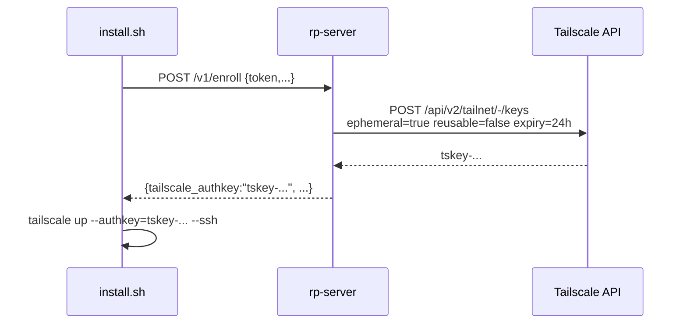

# Data plane — Tailscale

Tailscale is the entire data plane after bootstrap. The server runs the
standard `tailscaled` daemon plus `tailscale serve` as an identity-aware
reverse proxy; agents run `tailscaled` too. No bespoke Go sidecar, no
embedded `tsnet`.

## Why Tailscale

| Need | Tailscale provides |
|------|--------------------|
| NAT/CGNAT traversal | WireGuard + DERP relay |
| Identity for agents | `Tailscale-User-Login` header injection via `tailscale serve` |
| Declarative ACLs | `policy.hujson` with tags, groups, ssh rules |
| MagicDNS | `rp-server.tailnet.ts.net` resolves on every node |
| Bootstrap auth-keys | API `POST /api/v2/tailnet/-/keys` with `ephemeral=true, reusable=false, expiry=24h` |
| Free tier sufficiency | Personal Free (Apr 2026): unlimited devices, 6 users |

## Tags

Every node has at least one tag, set at enrollment:

| Tag | Owner | Used for |
|-----|-------|----------|
| `tag:rp-server` | `ramon@monxas.casa` | LXC 280 only. |
| `tag:rp-agent-prod` | `ramon@monxas.casa` | Production hosts. |
| `tag:rp-agent-family` | `ramon@monxas.casa` | Family hosts. |
| `tag:rp-agent-iarq` | `ramon@monxas.casa` | iarquitectos client hosts. |

## ACL policy

This is the canonical snippet (ADR-0008 Appendix E). It is maintained at
`tailscale.com/admin/acls` for the `monxas` tailnet:

```json
{
  "tagOwners": {
    "tag:rp-server":       ["ramon@monxas.casa"],
    "tag:rp-agent-prod":   ["ramon@monxas.casa"],
    "tag:rp-agent-family": ["ramon@monxas.casa"],
    "tag:rp-agent-iarq":   ["ramon@monxas.casa"]
  },

  "groups": {
    "group:admins":   ["ramon@monxas.casa"],
    "group:family":   ["hermano@example.com"],
    "group:iarq":     ["cliente@iarquitectos.com"]
  },

  "acls": [
    { "action": "accept", "src": ["group:admins"], "dst": ["*:*"] },
    { "action": "accept", "src": ["tag:rp-server"],
      "dst": ["tag:rp-agent-prod:*", "tag:rp-agent-family:*", "tag:rp-agent-iarq:*"] },
    { "action": "accept",
      "src": ["tag:rp-agent-prod", "tag:rp-agent-family", "tag:rp-agent-iarq"],
      "dst": ["tag:rp-server:443,8080"] },
    { "action": "accept", "src": ["group:family"], "dst": ["tag:rp-agent-family:*"] },
    { "action": "accept", "src": ["group:iarq"], "dst": ["tag:rp-agent-iarq:*"] }
  ],

  "ssh": [
    { "action": "check", "src": ["group:admins"],
      "dst": ["tag:rp-agent-prod", "tag:rp-agent-family", "tag:rp-agent-iarq"],
      "users": ["autogroup:nonroot", "root"] },
    { "action": "check", "src": ["group:family"],
      "dst": ["tag:rp-agent-family"], "users": ["autogroup:nonroot"] }
  ],

  "tests": [
    { "src": "group:family", "accept": ["tag:rp-agent-family:22"],
      "deny": ["tag:rp-agent-prod:22"] },
    { "src": "tag:rp-agent-iarq", "deny": ["tag:rp-agent-prod:*"] }
  ]
}
```

Key invariants enforced by this policy:

- **No lateral movement.** Agents cannot reach other agents. The default-deny
  rule (anything not explicitly accepted is denied) prevents a compromised
  host from pivoting.
- **Server-to-agent unidirectional.** The server reaches every agent for
  command delivery, but agents only reach the server on ports `443, 8080`.
- **Group scoping.** Family users see only family agents; iarq users see
  only iarq agents.
- **Tailscale SSH `check` mode.** Every interactive SSH session re-validates
  via passkey — no long-lived SSH sessions.

## Identity injection

`tailscale serve` runs on LXC 280 with:

```bash
tailscale serve --bg --https=443 / http://127.0.0.1:8080
```

For every request that crosses the proxy, Tailscale daemon adds:

- `Tailscale-User-Login: ramon@monxas.casa`
- `Tailscale-User-Name: Ramón Kamibayashi`
- `Tailscale-Headers: tailscale-user-login,tailscale-user-name`

FastAPI consumes these via a `tailscale_identity()` dependency. If the
headers are missing, the request **did not come through `tailscale serve`**
(i.e. someone hit `0.0.0.0:8443` directly) and is rejected with 401 unless
the route is on the bootstrap allowlist (`/v1/enroll`, `/v1/agent/reauth`).

## Bootstrap auth-keys

During enrollment the server allocates an **ephemeral, single-use, 24-hour**
Tailscale auth-key via the Tailscale API, scoped to the right `tag:`. The
key never persists in the database after the enrollment record is closed.



## Operational notes

- **Server identity rotation:** if the LXC 280 device is replaced, run
  `tailscale up --force-reauth` and update tagOwners as needed. The agents
  reconnect via the tailnet hostname `rp-server.tailnet.ts.net`, so the
  underlying IP can change freely.
- **DERP fallback:** if direct WireGuard fails, traffic transparently
  relays via Tailscale's DERP servers. Visible in `tailscale netcheck`.
- **Escape hatch:** if Tailscale Inc. changes pricing or policy
  unacceptably, the documented migration target is **NetBird**
  (control-plane OSS, similar ACL JSON). Headscale is the second option.

## See also

- [Security model](security.md)
- [Components](components.md)
- [Tailscale docs — SSH ACLs](https://tailscale.com/kb/1193/tailscale-ssh)
