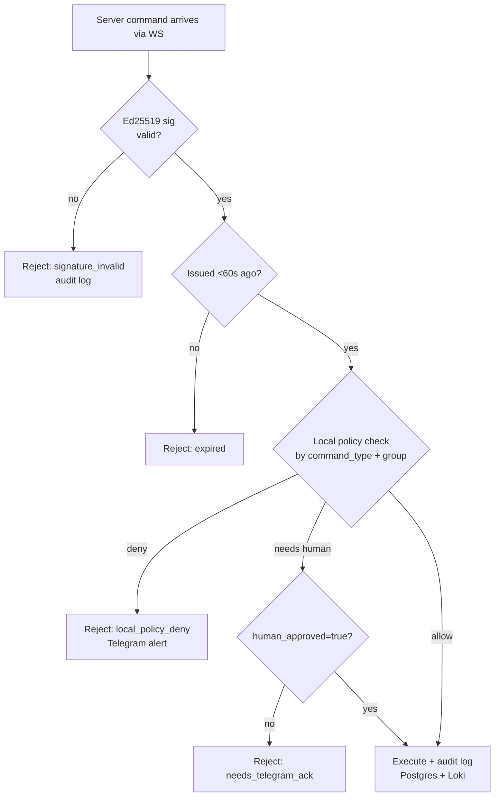
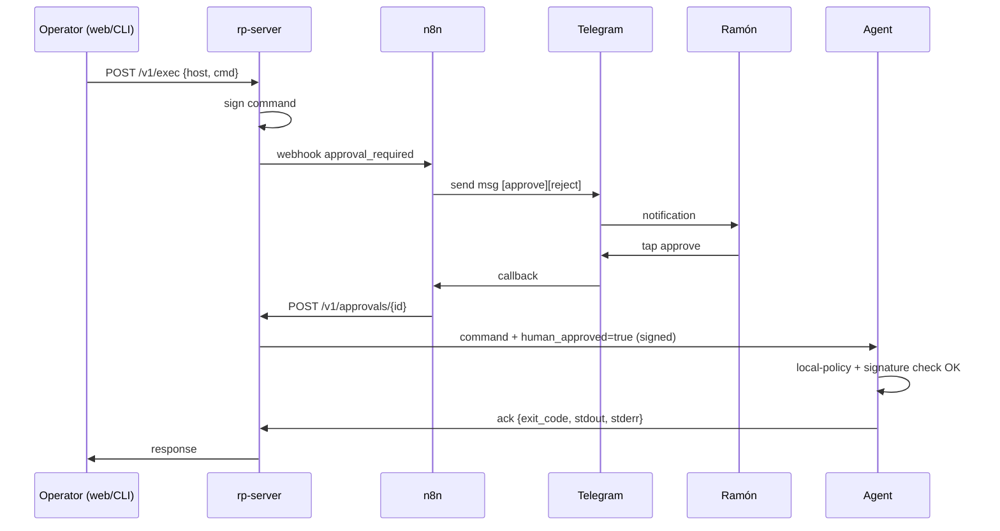

# Local-approval enforcement

Remote-Pulse's most important security feature is **agent-side defense-in-depth**.
Even if the server is fully compromised and the attacker can forge any signed
command, they cannot execute destructive operations on `prod` / `iarq` hosts
without:

1. A flag file in `/etc/rp/` that the attacker cannot create remotely.
2. (For the worst operations) a human ack via Telegram inside a 5-minute TTL.

This page explains the decision model, the flags, how to flip them, and how
the Telegram approval flow integrates.

## Why this exists

The server holds the Ed25519 signing key and is therefore a single high-value
target. Audit log alone (post-mortem) does not prevent damage. The fix
adopted during the ADR-0008 devil's advocate review (mitigation C3) is to
move the *authorisation* check into the agent itself, gated by filesystem
state that can only be modified locally (root SSH or console access).

The result: a compromised server can read metrics, query inventory, and
exec on `family`/`default` hosts (acceptable blast radius) but **cannot**
rm-rf a `prod` host.

## Decision flow



## Per-command-type policy matrix

This is the canonical matrix from ADR-0008 §13:

| Command | Group `prod`/`iarq` | Group `family`/`default` |
|---------|---------------------|--------------------------|
| `exec_shell` | Requires `/etc/rp/allow-remote-exec`. | Server auth alone is sufficient. |
| `pkg_install` | Two-tier: server sig **plus** Telegram approval. | `/etc/rp/allow-pkg-install`. |
| `service_restart` | Service name must match `/etc/rp/restart-whitelist`. Outside list = deny. | Same whitelist enforced. |
| `file_read` | Path must match `/etc/rp/read-allowlist` patterns. | Same allowlist enforced. |
| `file_write` | **Deny by default.** Requires `/etc/rp/allow-remote-write` **plus** Telegram approval for paths outside `/etc/rp/` and `/opt/rp/`. | Requires `/etc/rp/allow-remote-write`. |
| `screen_open` | No local restriction (display-only). | No local restriction. |
| `ssh_keys_sync` | Server-triggered system command; agent verifies `groups.yml` SHA256 signed by server matches. | Same. |
| `agent_upgrade` | Canary mode auto-allowed for ±1 minor. Major version jumps require Telegram. | Same. |
| `reboot` | Two-tier: server sig **plus** Telegram ack. | Single Telegram ack. |

## Flipping the flags

All flags live under `/etc/rp/` (Linux/macOS) or `%PROGRAMDATA%\rp\` (Windows)
and are managed by `rp local`. Each is a flag file containing optional TTL
metadata (JSON one-liner).

### Enable remote exec

```bash
# Permanent (until rp local deny-exec)
sudo rp local allow-exec

# Time-limited
sudo rp local allow-exec --ttl=4h
```

### Disable remote exec

```bash
sudo rp local deny-exec
```

### Approve writes (always TTL'd)

```bash
sudo rp local approve-write --ttl=5m
```

Use this **only when you are actively pushing a config**. Five minutes by
default; max 1 hour.

### Manage per-type whitelists

```bash
sudo rp local whitelist-add restart nginx.service
sudo rp local whitelist-add restart 'remote-pulse*'
sudo rp local whitelist-add read /var/log/syslog
sudo rp local whitelist-show restart
sudo rp local whitelist-rm restart nginx.service
```

Patterns use shell-glob semantics.

### Check current state

```bash
rp local status
```

Output:

```text
Local-policy state (group=prod):
  allow-remote-exec    : SET   (no TTL)
  allow-remote-write   : UNSET
  allow-pkg-install    : UNSET
  restart-whitelist    : 3 entries
  read-allowlist       : 2 entries
  last-policy-change   : 2026-05-20T18:22:11Z (by uid=0)
```

### Dry-run a command

Test whether a server-issued command *would* be allowed without actually
running it:

```bash
sudo rp local evaluate exec_shell \
  --payload='{"cmd":"systemctl restart nginx"}' \
  --group=prod
```

## TTL expiry

Flags with a TTL are checked on every command evaluation. Once expired, the
flag is treated as unset; the agent does **not** automatically delete the
flag file (so you can see the history), but it logs an `expired` reason on
each rejection.

## Telegram approval flow <span class="rp-badge planned">F4-6</span>

For commands that require human-in-the-loop:



TTL of the approval pending state is **5 minutes**. No response in that
window = auto-reject. The audit log records the approval token, who acked,
and exactly when.

## Audit log

Every command — accepted, rejected by signature, rejected by local policy,
rejected by approval timeout — lands in the `commands` Postgres table via
an immutable trigger (`BEFORE UPDATE OR DELETE ... RAISE EXCEPTION`) **and**
is shipped to Loki via Promtail with the label set
`{job="remote-pulse", host=..., cmd_type=...}`.

The double sink ensures forensics survive a Postgres compromise.

## Recommended posture

- `prod` hosts: leave all flags **unset by default**. Flip `allow-remote-exec`
  with a tight TTL only when you are actively running a maintenance window.
- `family`/`default` hosts: server-auth alone is fine; the absence of these
  flags blocks `file_write` and `pkg_install` until you opt in.
- Review `rp local status` after every server upgrade and on a quarterly
  cadence.

## See also

- [Security model](../architecture/security.md)
- [`rp` CLI reference — `rp local`](cli.md#local-approval-enforcement-f4)
- [ADR-0008 §13 — Commands matrix](https://docs.monxas.casa/architecture/adr/ADR-0008-remote-pulse/)
