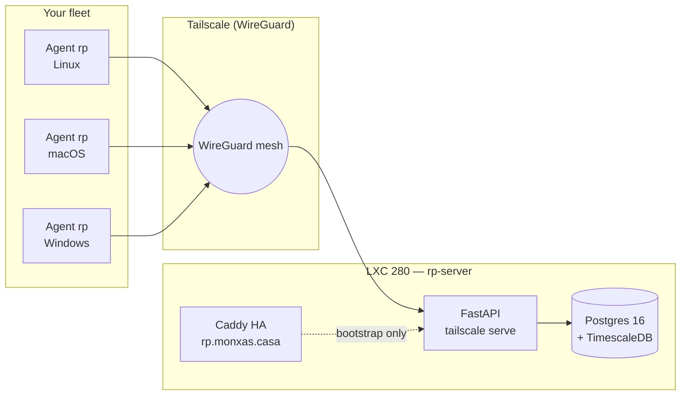

# Remote-Pulse

> **Single pane of glass + single command onboarding** for every machine you own.

Remote-Pulse is an agent plus server platform that turns a heterogeneous fleet
(homelab boxes, family laptops, client servers) into one dashboard with live
sparklines, declarative SSH key lifecycle, and audited remote control over
Tailscale.

Install on any Linux, macOS or Windows host with **one command**. Aggregated
view of CPU, memory, disk and network in real time. Defense-in-depth design:
a compromised server cannot escalate to destructive operations on production
hosts without an explicit local flag *and* a human Telegram approval.

## Features

- **One-command install** — Linux/macOS curl-pipe-sh, Windows `winget install`.
  Under 60 seconds from zero to dashboard.
- **NAT-agnostic data plane** — all agent traffic rides WireGuard via
  Tailscale. No port-forwarding, no public SSH.
- **TUI + Web + Grafana** — three dashboards backed by the same TimescaleDB
  data layer.
- **SSH key lifecycle** — declarative groups, instant revocation, immutable
  audit log.
- **Remote shell + screen** — Tailscale SSH, RustDesk Direct IP, Sunshine for
  GPU hosts.
- **Defense-in-depth** — agent-side `/etc/rp/` flag files + Telegram approval
  flow gate destructive ops in `prod`/`iarq` groups.
- **Open source agent** — Apache-2.0, auditable, no telemetry phone-home to
  third parties.

## Architecture at a glance

## Get started

- :material-rocket-launch: **[Install Linux/macOS](quickstart/install-unix.md)**

    One curl-pipe-sh, audit-first mode included.

- :material-microsoft-windows: **[Install Windows](quickstart/install-windows.md)**

    `winget install Monxas.RemotePulse`.

- :material-television-guide: **[Open the TUI dashboard](guide/tui-dashboard.md)**

    `rp dash` — sparklines for every host.

- :material-shield-lock: **[Security model](architecture/security.md)**

    Three-layer auth + agent-side defense-in-depth.

!!! info "Pre-alpha"
    Remote-Pulse is currently pre-alpha. F1-F4 of the
    [ADR-0008 roadmap](https://docs.monxas.casa/architecture/adr/ADR-0008-remote-pulse/)
    are in progress. APIs may change before v1.0.0 GA.
